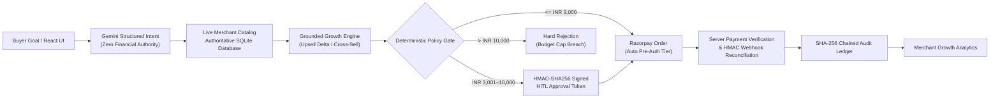

# AgentCart — Agentic Commerce Infrastructure on Razorpay Rails

**Razorpay AI Buildathon 2026 · Track 1: AI Growth & Agentic Commerce**

> **One-Line Proposition:** AgentCart enables merchants to become securely transactable by autonomous AI buyers while maximizing catalog-grounded average order value (AOV) through deterministic financial guardrails on Razorpay rails.

---

## 1. Problem & Challenge

As autonomous AI agents represent an increasing share of e-commerce buyer traffic, merchants face two critical challenges:
1. **Financial & Security Exposure**: Giving language models financial authority creates severe risks of price hallucination, prompt injection exploits, quantity manipulation, and unauthorized payment capture.
2. **Missed Merchant Growth**: Keyword-based search interfaces fail to capture high-intent multi-item baskets, catalog-grounded upgrades (upsells), and compatible attachments (cross-sells).

---

## 2. Solution Overview

AgentCart solves these challenges by establishing a **strict boundary between AI reasoning and deterministic financial execution**:
- **Gemini Buyer Agent**: Interprets natural language shopping goals into structured parameters.
- **Catalog-Grounded Growth Engine**: Evaluates live compatibility graphs to surface contextual upgrades and attachments.
- **Deterministic Policy Engine**: Recalculates all cart totals from authoritative SQLite database records, enforcing hard spending tiers and single-use cryptographic approval tokens.
- **Razorpay Rails**: Executes secure orders in Test Mode with HMAC-SHA256 signature and webhook verification.
- **Tamper-Evident SHA-256 Audit Ledger**: Cryptographically links every lifecycle event for non-repudiable transaction auditability.

---

## 3. System Architecture



---

## 4. LLM Authority Boundary

To prevent financial loss and prompt injection vulnerabilities, AgentCart strictly isolates LLM reasoning from financial execution.

| Capability | Gemini / LLM Agent | Server-Side Policy & Payment Rails |
| :--- | :---: | :---: |
| Extract buyer category, budget & quantity | **YES** | Validates schema |
| Rank relevant catalog products | **YES** | Grounded against live DB |
| Explain recommendation rationale | **YES** | Informational display |
| **Set product unit prices** | **NO (Zero Authority)** | **YES (Authoritative DB Truth)** |
| **Approve financial transactions** | **NO (Zero Authority)** | **YES (Policy Gate Enforcement)** |
| **Bypass spending limits** | **NO (Zero Authority)** | **YES (Immutable Ceilings)** |
| **Sign HITL approval tokens** | **NO (Zero Authority)** | **YES (HMAC-SHA256 Server Secret)** |
| **Execute payment capture** | **NO (Zero Authority)** | **YES (Razorpay Rails)** |

### Execution Flow
```
Buyer Goal
  -> Gemini (Extract intent parameters)
    -> Live Catalog DB (Fetch authoritative prices & stock)
      -> Growth Engine (Evaluate catalog-grounded upsell/cross-sell)
        -> Policy Gate (Enforce spending tiers & DB totals)
          -> HITL Token / Auto Approval (Cryptographic sign-off)
            -> Razorpay (Order creation & checkout)
              -> Verification (HMAC signature & webhook check)
                -> SHA-256 Audit Ledger (Chained recording)
                  -> Merchant Analytics Dashboard
```

---

## 5. Financial Policy Tiers & Guardrails

The server enforces three immutable financial governance tiers:

1. **Autonomous Pre-Authorization (≤ ₹3,000.00)**:
   - Orders within the pre-approved budget with verified stock and price integrity are created and authorized autonomously.
2. **Human-in-the-Loop Sign-off (₹3,001.00 – ₹10,000.00)**:
   - `HITL_REQUIRED` blocks order creation until the user submits a valid HMAC-SHA256 token signed by the server's `HITL_SIGNING_SECRET`.
   - Token is bound to `session_id`, `verified_total`, items cart digest, and expiration window, with persistent single-use consumption.
3. **Hard Spending Ceiling (> ₹10,000.00)**:
   - `REJECTED_OVER_BUDGET` blocks any transaction exceeding ₹10,000.00, regardless of user or LLM input.

---

## 6. Catalog-Grounded Growth Engine

AgentCart increases merchant revenue without hallucinating products or prices:
- **Same-Category Upsells**: Recommends premium upgrades within the same category only if the upgrade price is within the buyer's headroom budget.
- **Compatible Cross-Sells**: Recommends complementary attachments using catalog compatibility graphs (e.g. keyboard -> wrist rest/ergonomic mouse).
- **Revenue Attribution**: Incremental revenue is strictly calculated as `(Upsell Price - Base Price)` for upgrades and `Attachment Price` for cross-sells.

---

## 7. Security: Attack -> Defense Matrix

| Attack Vector | Attacker Action | AgentCart Defense Mechanism | Verified Status |
| :--- | :--- | :--- | :---: |
| **Client Price Tampering** | Proposes item at ₹99 instead of ₹799 | Policy engine recalculates from authoritative SQLite DB | **PASSED** |
| **LLM Price Hallucination** | LLM claims expensive keyboard is ₹1,000 | Server overrides LLM price with authoritative DB price | **PASSED** |
| **Missing HITL Token** | Submits HITL approval without token | Rejected with HTTP 403; logged as `HITL_REJECTED` | **PASSED** |
| **Forged HITL Token** | Submits fabricated HMAC signature | Cryptographic verification fails with HTTP 403 | **PASSED** |
| **Expired HITL Token** | Submits token past expiration window | Expiration validation fails with HTTP 403 | **PASSED** |
| **Cross-Session Replay** | Uses Session A's token for Session B | Bound `session_id` mismatch fails with HTTP 403 | **PASSED** |
| **HITL Amount Tampering** | Signs ₹2,499 token for ₹6,499 cart | Digest/amount claim mismatch fails with HTTP 400 | **PASSED** |
| **HITL Token Replay** | Replays already-consumed token | SQLite `used_hitl_tokens` table rejects reuse | **PASSED** |
| **Budget Ceiling Breach** | Attempts order > ₹10,000 | Policy gate strictly rejects (`REJECTED_OVER_BUDGET`) | **PASSED** |
| **Policy Override Attack** | Tries to set auto ceiling to ₹8,000 | Pydantic validator rejects values > ₹3,000 (HTTP 422) | **PASSED** |
| **Stock Manipulation** | Requests 9,999 units (exceeds stock) | Quantity & stock validation fails (`REJECTED_STOCK_ERROR`)| **PASSED** |
| **Stockout at Checkout** | Primary item depletes before buy | Agent intercepts stockout and auto-recovers to category alternative | **PASSED** |
| **Price Surge at Checkout** | Price surges immediately before buy | Discrepancy logged; authoritative price enforced | **PASSED** |
| **Payment Amount Mismatch** | Settle order with incorrect amount | Settlement assertion fails; capture prevented | **PASSED** |
| **Webhook Signature Forgery** | Attacker POSTs fake webhook event | Raw body HMAC-SHA256 verification fails (HTTP 401) | **PASSED** |
| **Duplicate Webhook** | Webhook delivery retries same event | Event ID idempotency returns duplicate (HTTP 200) | **PASSED** |
| **Duplicate Order Replay** | Submits duplicate order in window | Idempotency key cache rejects duplicate | **PASSED** |
| **Cross-Session Hijack** | Session B queries Session A order | Session binding mismatch rejected with ValueError | **PASSED** |
| **Audit Log Tampering** | Attacker alters historical record | SHA-256 chain verification detects mismatch | **PASSED** |
| **Audit Record Deletion** | Attacker deletes ledger entry | Chain break detected; invalidates hash integrity | **PASSED** |

---

## 8. Razorpay Rails Integration

- **Razorpay Test Mode**: Supports live Test Mode order creation and checkout flows.
- **Mock Sandbox Mode**: `RAZORPAY_MOCK_MODE=true` allows offline deterministic testing and CI verification without requiring live API keys.
- **Webhook Reconciliation**: Validates `X-Razorpay-Signature` against `RAZORPAY_WEBHOOK_SECRET` over raw payload bytes.
- **State Machine Transitions**: `CREATED -> CHECKOUT -> PAID / FAILED / CANCELLED`.

---

## 9. Failure Scenarios & Auto-Recovery

1. **Stockout Auto-Recovery**: If a selected product is depleted, the agent records `ERROR_RECOVERED` in the audit ledger and searches the catalog for an in-stock category alternative.
2. **Price Surge Rejection**: Cart totals are re-anchored to the live catalog, triggering appropriate policy tiers (auto vs HITL).
3. **Payment Failure**: Order transitions to `CANCELLED`/`FAILED` state with zero false capture.

---

## 10. Merchant Growth Analytics

The merchant dashboard exposes live metrics aggregated from runtime audit ledger events:
- **Total GMV**: Total settled transaction volume.
- **Base Product Revenue**: Revenue from core search intents.
- **Incremental Revenue**: Measured lift from accepted upsells and cross-sells.
- **Upsell / Cross-Sell Acceptance Rates**: Real-time conversion percentages.
- **HITL Ratio & Auto-Recoveries**: Governance oversight metrics.

---

## 11. Empirical Synthetic Benchmark

The benchmark (`evals/run_growth_evaluation.py`) evaluates 500 deterministic catalog sessions comparing baseline direct search against AgentCart's recommendation pipeline under **identical underlying buyer purchase propensities**.

| Metric | Baseline Direct Search | AgentCart Intent + Growth | Measured Lift / Delta |
| :--- | :--- | :--- | :--- |
| **Sessions Evaluated** | 500 | 500 | Shared synthetic evaluation |
| **Purchases Completed** | 260 | 260 | Shared buyer propensity baseline |
| **Conversion Rate** | 52.0% (95% CI ±4.38%) | **52.0%** (95% CI ±4.38%) | Fair baseline comparison |
| **Average Order Value (AOV)** | ₹3,737.49 (95% CI ±367.89) | **₹3,801.31** (95% CI ±370.39) | **+₹63.82 (+1.71%)** |
| **Revenue per Session** | ₹1,943.49 | **₹1,976.68** | **+₹33.19 (+1.71%)** |
| **Upsell Acceptance Rate** | — | **22.22%** | Catalog-grounded upgrade |
| **Cross-Sell Acceptance Rate** | — | **11.48%** | Compatible attachment |
| **Attribution: Base Product Revenue** | ₹971,747.00 | **₹971,747.00** | 100% catalog-grounded base |
| **Attribution: Upsell Incremental** | — | **₹8,000.00** | Upgrade price delta |
| **Attribution: Cross-Sell Incremental** | — | **₹8,593.00** | Compatible attachment value |
| **Net Incremental Revenue** | — | **₹16,593.00** | **+₹16,593.00** |

*Benchmark results are synthetic and deterministic; the evaluator does not trigger live revenue movement or manufacture artificial conversion bias.*

---

## 12. Verification & Test Suite Status

```bash
# Run complete test suite (88/88 tests)
python -m pytest evals/ -v

# Run 5-scenario terminal demo walkthrough
python evals/demo_walkthrough.py

# Run 500-session synthetic growth evaluator
python evals/run_growth_evaluation.py --sessions 500

# Validate frontend production build
cd frontend && npm run build
```

**Verified Test Breakdown:**
- End-to-End Agent Scenarios: `7/7 PASSED`
- Phase 1 Security & Ledger Integrity: `10/10 PASSED`
- Phase 2 Gemini Intent & Policy: `11/11 PASSED`
- Phase 3 Growth Engine & Recommendations: `18/18 PASSED`
- Phase 4 Razorpay Checkout Integration: `2/2 PASSED`
- Phase 5 Recommendation & Catalog Integrity: `6/6 PASSED`
- Phase 6 Order Lifecycle & Terminal States: `7/7 PASSED`
- Phase 7 Growth Evaluation & Webhook Reconciliation: `4/4 PASSED`
- Phase 8 Adversarial Security & Attack Invariants: `20/20 PASSED`
- **Total: 88/88 PASSED (100% pass rate, 0 failed, 0 skipped)**

---

## 13. Terminal Demo Walkthrough Scenarios

Running `python evals/demo_walkthrough.py` demonstrates:
1. **Scenario 1**: Autonomous low-value purchase (≤ ₹3,000).
2. **Scenario 2**: HITL high-value purchase with HMAC token sign-off (₹3,001–₹10,000).
3. **Scenario 3**: Stockout auto-recovery selecting in-stock category alternative.
4. **Scenario 4**: Price surge rejection re-anchoring to live DB price.
5. **Scenario 5**: Payment gateway failure handling with terminal state and zero false capture.

---

## 14. Quick-Start Setup

### Prerequisites
- Python 3.10+
- Node.js 18+

### 1. Environment Setup
```bash
cp .env.example backend/.env
```

### 2. Backend API
```bash
cd backend
python -m pip install -r requirements.txt
python main.py
```
- API: `http://localhost:8000`
- Swagger Docs: `http://localhost:8000/docs`

### 3. Frontend Web App
In a separate terminal:
```bash
cd frontend
npm install
npm run dev
```
- Vite App: `http://localhost:5173`

---

## 15. Secret Audit & Configuration

```env
GEMINI_API_KEY=your_gemini_api_key_here
RAZORPAY_KEY_ID=rzp_test_your_key_id
RAZORPAY_KEY_SECRET=your_test_secret
RAZORPAY_WEBHOOK_SECRET=your_webhook_secret
HITL_SIGNING_SECRET=your_hitl_signing_secret_here
AGENTCART_DEMO_MODE=true
RAZORPAY_MODE=test
RAZORPAY_MOCK_MODE=true
```

---

## 16. Boundaries & Limitations

- **Payment Mode**: Executes on Razorpay Test Mode rails and mock sandbox flows; does not settle real currency.
- **Intent Parsing Fallback**: When `GEMINI_API_KEY` is not provided, the agent falls back to a deterministic keyword/regex heuristic parser without compromising security invariants.
