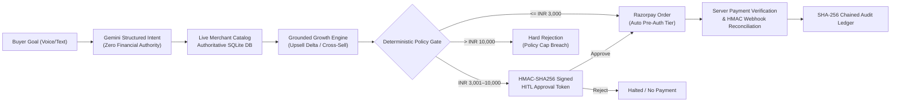

# AgentCart — Agentic Commerce Protocol on Razorpay Rails

**Razorpay AI Buildathon 2026 · Track 1: AI Growth & Agentic Commerce**

> **One-Line Proposition:** AgentCart enables merchants to become securely transactable by autonomous AI buyers while maximizing catalog-grounded average order value (AOV) through deterministic financial guardrails on Razorpay rails.

---

## 1. Problem & Solution

### The Challenge
As autonomous AI agents represent an increasing share of e-commerce traffic, giving language models direct financial authority creates severe risks:
1. **Price Hallucination & Exploits:** An LLM might hallucinate prices, miscalculate quantities, or fall victim to prompt injections.
2. **Unbounded Financial Spree:** Without deterministic bounds, runaway agent loops can drain accounts.
3. **Lack of Cryptographic Accountability:** Financial accounting requires non-repudiable, tamper-evident audit trails.

### The AgentCart Solution
AgentCart establishes **Zero Financial Authority for the LLM**:
* **Gemini Buyer Agent:** Interprets natural language shopping goals into structured parameters.
* **Deterministic Policy Engine:** Recalculates all cart totals from authoritative SQLite database records, enforcing three spending bounds:
  1. *Per-Transaction Limit (₹10,000)*: Hard block when exceeded.
  2. *Auto-Approve Ceiling (₹3,000)*: Orders exceeding this threshold require Human-in-the-Loop (HITL) sign-off.
  3. *Daily Spending Limit (₹25,000)*: Hard block when cumulative daily spend is exceeded.
* **Cryptographic HITL Gate:** HMAC-SHA256 single-use tokens for high-value approvals with complete Approve and Reject paths.
* **Merchant Growth Engine:** Grounded upsell upgrades and cross-sell add-ons with automated price recalculation and dynamic policy re-verification.
* **Razorpay Payment Rails:** Support for both live Razorpay Test Mode checkout and mock offline sandbox simulation with server-side HMAC-SHA256 verification.
* **Chained SHA-256 Audit Ledger:** Immutable, cryptographically hashed event stream recording every intent, policy check, HITL decision, and settlement.
* **Order History & Tracker:** Tabular view of all past orders, sessions, statuses, payment IDs, and linked cryptographic audit traces.
* **Voice Input:** Web Speech API integration allowing natural speech-to-text goal input.

---

## 2. Core Architecture & Authority Boundary



| Capability | Gemini / LLM Agent | Server-Side Policy & Payment Rails |
| :--- | :---: | :---: |
| Extract buyer category, budget & quantity | **YES** | Validates schema |
| Rank relevant catalog products | **YES** | Grounded against live DB |
| Explain recommendation rationale | **YES** | Informational display |
| **Set product unit prices** | **NO (Zero Authority)** | **YES (Authoritative DB Truth)** |
| **Approve financial transactions** | **NO (Zero Authority)** | **YES (Policy Gate Enforcement)** |
| **Bypass spending limits** | **NO (Zero Authority)** | **YES (Immutable Ceilings)** |
| **Sign HITL approval tokens** | **NO (Zero Authority)** | **YES (HMAC-SHA256 Server Secret)** |
| **Execute payment capture** | **NO (Zero Authority)** | **YES (Razorpay Rails)** |

---

## 3. Key Demo Scenarios

| Scenario | Natural Language Goal | Amount | Policy Gate | Outcome |
| :--- | :--- | :---: | :---: | :--- |
| **1. Autonomous Purchase** | *"Buy 3 HDMI cables for my office"* | ₹2,397 | $\le$ ₹3,000 Ceiling | Pre-authorized autonomously on Razorpay rails |
| **2. HITL Approval** | *"Purchase 1 Keychron K2 keyboard"* $\rightarrow$ Approve | ₹6,499 | ₹3,001–₹10,000 | Human approves $\rightarrow$ Settled on Razorpay |
| **3. HITL Rejection** | *"Purchase 1 Keychron K2 keyboard"* $\rightarrow$ Reject | ₹6,499 | ₹3,001–₹10,000 | Human rejects $\rightarrow$ Halted immediately, zero capture |
| **4. Hard Policy Block** | *"Buy 13 HDMI cables for my office"* | ₹10,387 | $>$ ₹10,000 Limit | **HARD BLOCK**, no payment initiated, no settlement |
| **5. Order History & Audit** | Click **Order History** $\rightarrow$ **"View Logs"** | N/A | Authoritative Orders | Navigates to filtered SHA-256 cryptographic audit logs |
| **6. Voice Input** | Click Mic icon $\rightarrow$ Speak shopping goal | N/A | Speech recognition | Natural Language Goal field populated |
| **7. Cross-Sell Add to Cart** | Add compatible accessory to cart proposal | Recalculated | Re-verifies policy | Added to proposal $\rightarrow$ Settled |

---

## 4. How to Run Locally

### 1. Backend Setup & Run
```powershell
# In repository root:
python -m uvicorn backend.main:app --host 127.0.0.1 --port 8000 --reload
```

### 2. Frontend Setup & Run
```powershell
# In frontend directory:
cd frontend
npm install
npm run dev
```
Open [http://localhost:5173](http://localhost:5173) in your browser.

### 3. Run Automated Tests
```powershell
python -m pytest evals/ -v
```

---

## 5. Verified Testing & Build Status

* **Backend Automated Test Suite:** `python -m pytest evals/ -v` $\rightarrow$ **88/88 passed (100%)** in 12.01s.
* **Frontend Production Build:** `cd frontend && npm run build` $\rightarrow$ **Success (`✓ built in 3.59s`, 0 errors)**.

---

## 6. FINAL PROJECT STATUS

> **Status:** **FEATURE-COMPLETE & VERIFIED FOR FINAL DEMO**  
> All requirements are implemented, tested, and validated. No further feature development is required.
