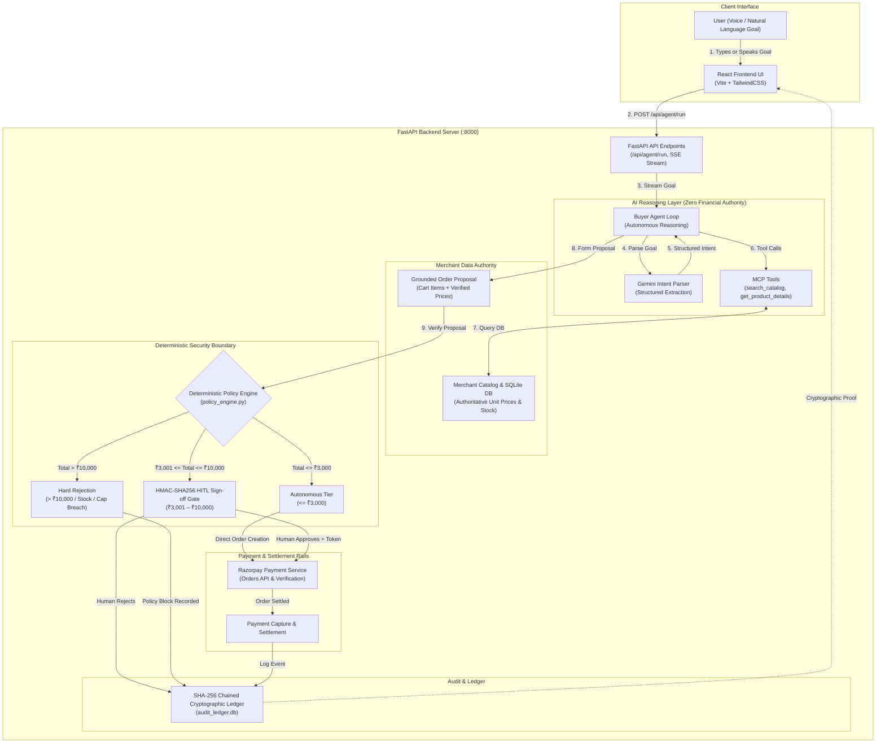

# AgentCart Architecture & Security Specification

**AgentCart — Autonomous Commerce Protocol on Razorpay Rails**  
*Track 1: AI Growth & Agentic Commerce · Razorpay AI Buildathon 2026*

---

## 1. Executive Summary & Core Security Principle

AgentCart is an autonomous agentic commerce protocol that enables AI agents to discover, negotiate, and purchase merchant goods while enforcing strict, deterministic financial guardrails on Razorpay rails.

### The Fundamental Security Axiom
$$\mathbf{Zero\ Financial\ Authority\ for\ the\ LLM}$$

> **"The AI never directly decides or controls the amount that can be spent. Financial authorization is performed exclusively by deterministic backend policy checks."**

```
┌──────────────────────────────────────────────────────────────────────────┐
│                             AUTHORITY BOUNDARY                           │
├─────────────────────────────────────┬────────────────────────────────────┤
│         AI / LLM LAYER              │     DETERMINISTIC BACKEND LAYER    │
│  (Zero Financial Authority)         │     (Full Financial Authority)     │
├─────────────────────────────────────┼────────────────────────────────────┤
│ • Natural Language Intent Parsing   │ • Authoritative Price Verification │
│ • Catalog Semantic Search & Ranking │ • Arithmetic Total Calculation     │
│ • Purchase Rationale & Explanation  │ • Spending Policy Enforcement      │
│ • Upsell / Cross-Sell Reasoning     │ • HMAC-SHA256 Cryptographic Tokens │
│                                     │ • Razorpay Payment Creation/Verify │
│                                     │ • Immutable SHA-256 Audit Ledger   │
└─────────────────────────────────────┴────────────────────────────────────┘
```

---

## 2. End-to-End Request & Transaction Flow



---

## 3. System Components & Architecture

### 1. React Frontend (`frontend/src/App.tsx`)
- **Technology:** React 18, TypeScript, Vite, TailwindCSS, Lucide Icons.
- **Role:** Interactive operator console providing:
  - Natural language goal input and **Web Speech API voice transcription**.
  - Real-time **Server-Sent Events (SSE)** execution activity streaming.
  - Interactive **Human-in-the-Loop (HITL)** approval/rejection card.
  - Dedicated views: **Product**, **Order History**, **Catalog Manager**, **Analytics**, **Policy & Security**, and **Audit Ledger**.

### 2. FastAPI Backend Server (`backend/main.py`)
- **Technology:** FastAPI, Python 3.11+, Pydantic v2, Uvicorn.
- **Role:** High-performance async API gateway managing:
  - Streaming SSE endpoint (`/api/agent/run`).
  - Cryptographic HITL sign-off endpoints (`/api/agent/approve-hitl`, `/api/agent/reject-hitl`).
  - Payment verification & webhook reconciliation (`/api/payments/verify`, `/api/payments/webhook`).
  - Catalog query & simulation endpoints (`/api/catalog/*`).
  - Policy configuration & live metrics (`/api/policy`, `/api/orders`, `/api/audit-logs`).

### 3. Gemini Intent Layer (`backend/agent/buyer_intent.py`)
- **Technology:** Google Gemini API (`gemini-3.5-flash-lite` / `gemini-1.5-flash`) via structured JSON schema, with a deterministic heuristic fallback parser.
- **Role:** Translates ambiguous natural language shopping instructions into structured `BuyerIntent` models (category, target budget, quantity, required features, exclusions).
- **Security Boundary:** The LLM only interprets buyer *intent*. It cannot assign unit prices or authorize payments.

### 4. Buyer Agent (`backend/agent/buyer_agent.py`)
- **Role:** Orchestrates the multi-step purchasing lifecycle:
  1. **Goal Intake & Parsing:** Extracts structured intent.
  2. **Catalog Discovery:** Calls MCP tools to query live merchant inventory.
  3. **Growth Evaluation:** Evaluates catalog-grounded upsells and cross-sells.
  4. **Proposal Construction:** Assembles itemized `OrderProposal`.
  5. **Policy Verification:** Hands the proposal to the deterministic policy engine.
  6. **Payment Execution:** Interfaces with Razorpay rails upon authorization.

### 5. Model Context Protocol (MCP) Tools (`backend/agent/tools.py`)
- **Functions:**
  - `tool_search_catalog(query, category, max_price)`: Live keyword/category search.
  - `tool_get_product_details(product_id)`: Fetches authoritative unit price, stock, specs, and rating.
  - `tool_check_policy_limits()`: Reads active spending boundaries for agent awareness.

### 6. Merchant Catalog & Database (`backend/merchant/catalog.py`)
- **Technology:** SQLite database (`audit_ledger.db` / memory) with authoritative merchant tables.
- **Role:** The single source of truth for product availability, live inventory stock, and canonical unit prices (e.g. Braided 4K HDMI Cable = ₹799).

### 7. Deterministic Policy Engine (`backend/security/policy_engine.py`)
- **Role:** Absolute gatekeeper of all financial operations. Recalculates cart totals from SQLite records:
  $$\text{Verified Total} = \sum (\text{Authoritative Unit Price} \times \text{Quantity})$$
- **Enforces Canonical Limits:**
  - **Auto-Approve Ceiling:** $\le \text{₹3,000}$ (Autonomous pre-authorization).
  - **Per-Transaction Limit:** $\le \text{₹10,000}$ (Hard ceiling, transactions $> \text{₹10,000}$ are blocked).
  - **Daily Spending Limit:** $\le \text{₹25,000}$ (Cumulative rolling daily spend).
  - **Category Whitelist & Live Stock Verification**.

### 8. Human-in-the-Loop (HITL) Cryptographic Gate
- **Role:** Secures transactions between ₹3,001 and ₹10,000.
- **Mechanism:** The server generates a single-use **HMAC-SHA256 signature** bound to `(session_id, verified_total, idempotency_key, timestamp)`.
- **Approval:** Requires a signed HTTP request with the valid HMAC token. The token is immediately consumed to prevent replay attacks.
- **Rejection:** Halts execution immediately; no Razorpay order is captured, and the rejection is logged to the audit ledger.

### 9. Razorpay Payment Rails (`backend/payments/razorpay_client.py`)
- **Role:** Manages Razorpay order generation, signature verification, and settlement.
- **Modes:**
  - **Razorpay Test Mode:** Live Razorpay Standard Checkout modal with real server-side HMAC-SHA256 signature verification.
  - **Mock Sandbox Mode:** High-speed deterministic simulation for automated test suites and offline presentations.

### 10. Chained SHA-256 Cryptographic Audit Ledger (`backend/audit/ledger.py`)
- **Role:** Tamper-evident, immutable audit trail for complete financial governance.
- **Mechanism:** Every system event (Intent, Policy Check, HITL Decision, Payment Capture, Rejection) is recorded with a chained cryptographic hash:
  $$\text{Hash}_n = \text{SHA-256}(\text{Hash}_{n-1} \parallel \text{Timestamp} \parallel \text{Event Type} \parallel \text{Payload JSON})$$
- **Tamper Detection:** Modifying or deleting any historical entry breaks the hash chain for all subsequent entries, making any alteration immediately detectable.

### 11. Session, Idempotency & Security Controls
- **Idempotency Key:** SHA-256 digest of session items and timestamps to prevent duplicate charges within a 5-minute sliding window.
- **Replay Protection:** Persistent storage of consumed HITL tokens.
- **Strict CORS & Input Validation:** Pydantic schemas on all endpoints.

---

## 4. The Three Policy Gate Outcomes

| Policy Outcome | Transaction Amount | Verification Action | Final State |
| :--- | :---: | :--- | :--- |
| **1. Autonomous Pre-Auth** | $\le \mathbf{₹3,000}$ | Policy engine verifies price, stock, category & daily spend $\rightarrow$ approves without human delay. | **Auto-Settled on Razorpay** |
| **2. Human-in-the-Loop (HITL)** | $\mathbf{₹3,001\text{ to }₹10,000}$ | Policy engine issues single-use HMAC token $\rightarrow$ UI presents sign-off modal $\rightarrow$ Human approves or rejects. | **Approved $\rightarrow$ Settled**<br/>OR **Rejected $\rightarrow$ Halted** |
| **3. Hard Policy Block** | $>\mathbf{₹10,000}$ | Server-side hard rejection. Cannot be overridden by agent or client. | **Blocked / Zero Payment** |

---

## 5. Directory & File Reference

```
agentcart-razorpay/
├── backend/
│   ├── main.py                      # FastAPI app, SSE streaming & endpoints
│   ├── config.py                    # Environment settings & canonical limits
│   ├── agent/
│   │   ├── buyer_agent.py           # Multi-step buyer agent reasoning engine
│   │   ├── buyer_intent.py          # Gemini structured intent parser
│   │   └── tools.py                 # MCP catalog & policy tools
│   ├── security/
│   │   └── policy_engine.py         # Deterministic financial policy engine & HMAC
│   ├── merchant/
│   │   ├── catalog.py               # Authoritative SQLite catalog & inventory
│   │   ├── growth_engine.py         # Catalog-grounded upsell / cross-sell logic
│   │   ├── analytics.py             # Merchant growth & financial analytics
│   │   └── models.py                # Pydantic data models
│   ├── payments/
│   │   └── razorpay_client.py       # Razorpay orders, checkout & HMAC verification
│   └── audit/
│       ├── ledger.py                # SHA-256 chained audit ledger
│       └── audit_ledger.db          # Persistent SQLite database
├── frontend/
│   ├── src/
│   │   ├── App.tsx                  # Complete React UI & operator console
│   │   └── main.tsx                 # React entry point
│   └── package.json
└── docs/
    ├── ARCHITECTURE.md              # This specification document
    ├── architecture.mmd             # Standalone Mermaid architecture diagram
    └── 5_MINUTE_PITCH_TRANSCRIPT.md # Complete spoken pitch script for Prince
```
